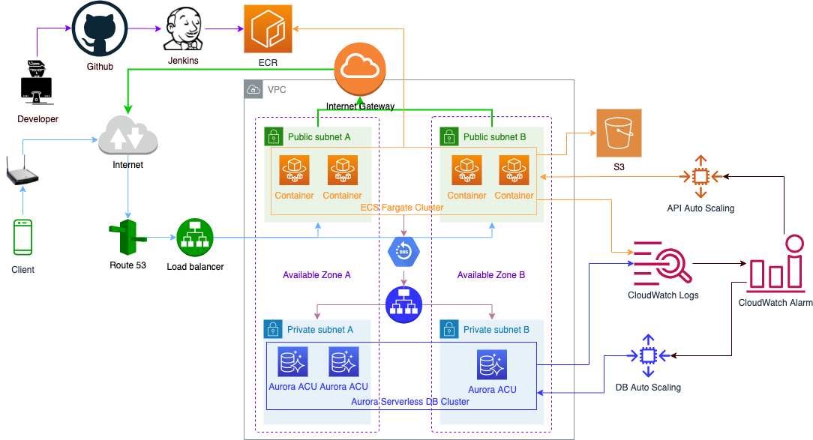

<h1 align="center">AWS Infrastructure as Code example</h1>
<p align="center">This project is the collections of tools and templates (configuration files) to deploy the infrastructure on AWS automatically.</p>

This is a part of demonstration for the talk show "DevOps in the real world". The videos for the talk show were published on Youtube, you can found them on [my chanel](https://www.youtube.com/channel/UCFM3plFG0QUavW1FPfize7g).

<p style="color:#fc6a0f"> Warning: Running the commands below will change / create resources on AWS. They can affect directly to current running services. It also effect right away to the amount of money we have to pay for AWS. So, please make sure you understand what you are doing when you run the commands below either changing any specification in the templates.</p>


# 1. Prerequisites
Make sure these tools or config are ready on your PC:
* [AWS Command Line Interface](https://aws.amazon.com/cli/) or [AWS CLI version 2 Docker image](https://docs.aws.amazon.com/cli/latest/userguide/install-cliv2-docker.html) have been installed.
* You already [Configuring the AWS CLI](https://docs.aws.amazon.com/cli/latest/userguide/cli-chap-configure.html) for your PC
* [Create](https://docs.aws.amazon.com/AmazonECR/latest/userguide/repository-create.html) an [Elastic Container Repository](https://docs.aws.amazon.com/AmazonECR/latest/userguide/what-is-ecr.html) and push your docker image there.
* Use [Secrets Manager](https://docs.aws.amazon.com/secretsmanager/latest/userguide/intro.html) create secret keys (username, password,...etc) for acessing database / authentication with third parties services.
* Make sure the certificates for your domains have been [issued](https://docs.aws.amazon.com/acm/latest/userguide/gs.html) and managed by [AWS Certificate Manager](https://docs.aws.amazon.com/acm/latest/userguide/acm-overview.html)
* If you delete the stack, the logs still remain. Make sure to rename or delete [Log groups](https://us-east-2.console.aws.amazon.com/cloudwatch/home?region=us-east-2#logsV2:log-groups) it on ClouldWatch


# 2. Deploy infrastructure
* Validate the template. Only move to the next steps if the template is fine. You should validate the template every time you change it, before committing to git repository.
    ```
    aws cloudformation validate-template --template-body file://$(pwd)/templates/infrastructure.yaml
    ```
* Deploy stack:
    ```
    aws cloudformation create-stack --stack-name <statk-name> --template-body file://$(pwd)/templates/infrastructure.yaml  --parameters file://<path-to-parameters-file> --capabilities CAPABILITY_NAMED_IAM
    ```
    Take a look on [./parameters/prod.json](./parameters/prod.json) for an example of parameters file.
* Update stack:
    ```
    aws cloudformation update-stack --stack-name <statk-name> --template-body file://$(pwd)/templates/infrastructure.yaml  --parameters file://<path-to-parameters-file> --capabilities CAPABILITY_NAMED_IAM
    ```
    Take a look on [./parameters/prod.json](./parameters/prod.json) for an example of parameters file.
* Delete stack:
    ```
    aws cloudformation delete-stack --stackname <statk-name>
    ```

# 3. Which ones will be created on AWS
By default, the parameter `MultiAvailabilityZones` were turn off. If you set it to `true`, these templates will deploy an VPC with 2 cluster:
* An ECS cluster for API
    * A task definition for the container
    * An ECS service
    * A load balancer and its associated listener and target group. Multiple AZs are used for high availability, SSL is terminated at the load balancer, health checks are used.
    * The necessary IAM roles
    * Logging to CloudWatch Logs, including the creation of a log group
    * Security groups for the container and load balancer
    * A DNS record for Route 53
    * An auto scaling policy. It scales to keep CPU utilization at or below 50%.
* A Aurora serverles database cluser

The overview of infrastructure for EASY Loan look like the picture below:


# 4. Migrate database
Once you have created the infrastructure, take a look on the stack Outputs, then update [db-migration-task.json](./templates/db-migration-task.json), fill these values to the keys:
* `cluster` -> Get value from `ApiClusterArn`
* `subnets` -> Get value from `PublicAZASubnetId` or `PublicAZBSubnetId`.
* `securityGroups` -> Get value from `ApiConatinerSecurityGroupId`
* `taskDefinition` -> Get value from `DbMigrationTaskDefinitionArn`

Afeter that, call the command below to run the migration task

```
aws ecs run-task --cli-input-json file://<path-to/db-migration-task.json>
```

# 5. Update service
The command below can be call from CI/CD script for API repository (`It's not CI/CD for infrastructure`)
```
aws ecs update-service --cluster <ApiClusterArn> --service <ApiServiceName> --force-new-deployment
```
*Note*: 
* Take the values for `ApiClusterArn` / `ApiServiceName` from the stack Outputs.
* The CI/CD steps for API repository might look like this
    * Checkout source code
    * Build the container images
    * Push contaiter images to ECR
    * Migrate database
    * Update the services

# 6. CI/CD for infrastructure
We also setup CI/CD for the production environment. Any push/merge to the branch prod/release will triger a [Jenkins job](https://jenkins.damelagi.org/view/EASYLoan/job/Easy-loan-prod-infrastructure/). It will update the stack (and infrastructure on AWS). The deployment on AWS is asynchronous, it will take a few minute to update all the changes.

# Reference
* [AWS CloudFormation](https://aws.amazon.com/cloudformation/)
* [AWS Command Line Interface](https://aws.amazon.com/cli/)
* [Using the official AWS CLI version 2 Docker image](https://docs.aws.amazon.com/cli/latest/userguide/install-cliv2-docker.html)
* [AWS CloudFormation: Using the AWS Command Line Interface](https://docs.aws.amazon.com/AWSCloudFormation/latest/UserGuide/cfn-using-cli.html)
* [Passing Parameters to CloudFormation Stacks with the AWS CLI and Powershell](https://aws.amazon.com/blogs/devops/passing-parameters-to-cloudformation-stacks-with-the-aws-cli-and-powershell/)
* [Validating a template](https://docs.aws.amazon.com/AWSCloudFormation/latest/UserGuide/using-cfn-validate-template.html)
* [AWS Systems Manager Parameter Store](https://docs.aws.amazon.com/systems-manager/latest/userguide/systems-manager-parameter-store.html)
* [AWS Secrets Manager](https://docs.aws.amazon.com/secretsmanager/)
* [How can I pass secrets or sensitive information securely to containers in an Amazon ECS task?](https://aws.amazon.com/premiumsupport/knowledge-center/ecs-data-security-container-task/)
* [Amazon Aurora Serverless](https://aws.amazon.com/rds/aurora/serverless/)
* [Using Amazon Aurora Serverless v1](https://docs.aws.amazon.com/AmazonRDS/latest/AuroraUserGuide/aurora-serverless.html)
* [Using Amazon ECS Exec for debugging](https://docs.aws.amazon.com/AmazonECS/latest/developerguide/ecs-exec.html)
* [Scheduling Amazon ECS tasks](https://docs.aws.amazon.com/AmazonECS/latest/developerguide/scheduling_tasks.html)
* [Running database migrations on deployment for Fargate containers](https://engineering.resolvergroup.com/2020/09/running-database-migrations-on-deployment-for-fargate-containers/)
* [run-task](https://docs.aws.amazon.com/cli/latest/reference/ecs/run-task.html)
* [Specifying sensitive data using Secrets Manager](https://docs.aws.amazon.com/AmazonECS/latest/developerguide/specifying-sensitive-data-secrets.html)
* [Services integrated with AWS Certificate Manager](https://docs.aws.amazon.com/acm/latest/userguide/acm-services.html)
* [ECS Task definitions: Using dynamic references to specify template values](https://docs.aws.amazon.com/AWSCloudFormation/latest/UserGuide/dynamic-references.html#dynamic-references-secretsmanager)
* [ECS Task definitions: Specifying environment variables](https://docs.aws.amazon.com/AmazonECS/latest/developerguide/taskdef-envfiles.html)
* [Pseudo parameters reference](https://docs.aws.amazon.com/AWSCloudFormation/latest/UserGuide/pseudo-parameter-reference.html)
* [Run ECS task by commandline](https://docs.aws.amazon.com/cli/latest/reference/ecs/run-task.html)
* [Execute command in ECS container](https://docs.aws.amazon.com/cli/latest/reference/ecs/execute-command.html)
* [Configure and Connect to Serverless MySQL Database](https://www.amazonaws.cn/en/getting-started/tutorials/configure-connect-serverless-mysql-database-aurora/)